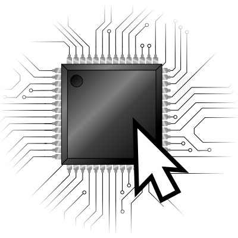
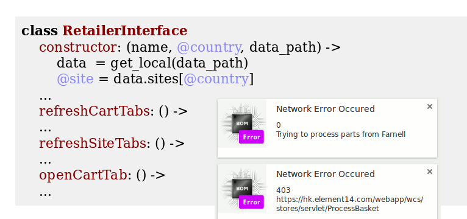

class: center, middle

<body>
<div id="header">
<div id="title"><span>1clickBOM</span></div>
</div>

####A browser extension to fill your electronic component shopping carts.
notes available at: [1clickBOM.com/fosdem15/notes.html](http://1clickBOM.com/fosdem15/notes.html)

---
# Me: Kaspar Emanuel

- Electronic design engineer and software developer
- C, C++, Python, Javascript, Haskell
- PCB Layout using KiCad
- Work as consultant

---
class: center, middle

<body>
<div id="header">
<div id="title"><span>1clickBOM</span></div>
</div>

###A browser extension to fill your electronic component shopping carts.

---

### 1. What does it do?
### 2. How does it do it?
### 3. What might it do in the future?

---

class: center, middle
# What does it do?
---
<video id=video class=screengrab src="screengrab.webm" controls></video>
---

---

---
# Features

- Chrome extension (Firefox is coming)
- Supports
    - Digikey
    - Mouser
    - Farnell/Element14
    - Newark
    - RS
- Over 100 locations
- CPAL license
---
# How does it do it?

- Parsing tab-seperated-values
- Mimicking http requests
- Parsing the HTML responses and using quick and dirty indicators to determine success or failure
---
# A little note on HTTP
- GET or POST (or others)
- parameters are sent along with the request
- returns status code (404, 403, 302) and response (usually HTML)
- cookies to persist data
---

---
```
curl
'http://uk.mouser.com/ProductDetail/Cree-Inc/CGHV96100F2/?Cree-Inc
%2fCGHV96100F2%2f&qs=sGAEpiMZZMvplms98TlKY6zbNRoARc
Ug8gg333Al67kStE%252bN8N0%2fKg%3d%3d'
-H 'Cookie: g11n=Up9NRXFGLVs=;
ME_Main=&ME_DSN=kJ0slznDUsNJMyNjQRiw8Q==&ME_DSU=YyaQEeoCnLc=;
ASP.NET_SessionId=zxtlgy45oobekaaphyv5n0z1;
_op_aixPageId=a2_60d31424-8123-4e84-b3f9-a18a6f8bfc3d-3648-87767;
CARTCOOKIEUUID=c46df9ef-39bb-4ada-bfcd-2452ed49bc8a; _gat=1;
__ar_v4=5UM3NRP3LFFG5JUPQ2VEXA%3A20150203%3A12%7CVPQ73SPSLBEPXM7QJ2MJRL%3A20150203%3A12%7CA463QQQT6VD37AVLWC4RZU%3A20150203%3A12;
SDG1=12; SDG2=40; SDG3=0; preferences=ps=gb&pl=en-GB&pc_gb=GBP;
_ga=GA1.2.91020740.1409853093;
__utma=261309969.91020740.1409853093.1417720020.1422769855.8;
__utmb=261309969.15.10.1422769855; __utmc=261309969;
__utmz=261309969.1409853093.1.1.utmcsr=(direct)|utmccn=(direct)|utmcmd=(none);
__utmv=261309969.|14=MYM=1638924=1^16=UV=5423887=1^18=Sub=1795089=1^19=PCAT=5367B8=1;
__atuvc=1%7C5; __atuvs=54cdc5eabb3480fd000; __utmli=ctl00_ContentMain_btnBuy2'
-H 'Origin: http://uk.mouser.com' -H 'Accept-Encoding: gzip, deflate' -H
'Accept-Language: en-GB,en-US;q=0.8,en;q=0.6' -H 'User-Agent: Mozilla/5.0 (X11;
Linux i686) AppleWebKit/537.36 (KHTML, like Gecko) Ubuntu Chromium/39.0.2171.65
Chrome/39.0.2171.65 Safari/537.36' -H 'Content-Type:
application/x-www-form-urlencoded' -H 'Accept:
text/html,application/xhtml+xml,application/xml;q=0.9,image/webp,*/*;q=0.8' -H
'Cache-Control: max-age=0' -H 'Referer:
http://uk.mouser.com/ProductDetail/Cree-Inc/CGHV96100F2/?qs=sGAEpiMZZMvplms98TlKY6zbNRoARcUg8gg333Al67kStE%252bN8N0%2fKg%3d%3d'
-H 'Connection: keep-alive' --data
'__EVENTTARGET=&__EVENTARGUMENT=&__VIEWSTATE=skTHKc%2BTu8q1ptksBWazoqW1jH%2F9s
30wKeqLaG6vPBO92Ae4BJFGniiNMJOdrxMC0BKNq0OgMPn9jzXyEnh%2BhZElrKrDDEwTj6wDz%2BB
5Mc8596z13lM4bwTtSkhsckjY87ZWffCEhuwhyb5YCmSMivmI453lwnERDa8eObcoNnPPaM0TNaN0o
X6eY%2FQ0eiyT%2FJsDR6vWe4u1sV0sPkLebGRRWfI4chXx3bL9X0CXPlXzEjYBjSMVFvahuPicHdx
N4QG31f8teVRA4a6JqwXeveNQi8J4yp2Euq3lgQnEjPAWpjeUEq5tXJbII8qczxQBrYBFu7ebLbyl
PNsPfrOeY6REXhUiEV1...
```
---
# Architecture

- Coffeescript
- Object Oriented
- Automated Functional Tests
- Simple GUI
---
class: center, middle
# Coffeescript
---
## Pros

- Terse but clear syntax

Coffeescript:
```coffeescript
add component for component in ['resistor', 'capacitor', 'diode']
```

Javascript:
```js
var components = ['resistor', 'capacitor', 'diode'];
for (var i = 0, len = components.length; i < len; i++) {
  component = components[i];
  add(component);
}
```
---
- Classes

```coffeescript
class Animal
  constructor: (@name) ->

  move: (meters) ->
    console.log @name + " moved #{meters}m."

class Snake extends Animal
  move: ->
    console.log "Slithering..."
    super 5
```
---
## Cons
- It's not Javascript
    - Another level of abstraction
    - Need to compile
        - Can be partially solved with continuous compilation
    - Errors in browser report JS line number
        - Can be solved with source-maps
---
class: center, middle
# Object Oriented
---

```coffeescript
class RetailerInterface
    constructor: (name, @country, data_path) ->
        data  = get_local(data_path)
        @site = data.sites[@country]
    ...
    refreshCartTabs: () ->
    ...
    refreshSiteTabs: () ->
    ...
    openCartTab: () ->
    ...
```
```coffeescript
class Farnell extends RetailerInterface
    constructor: (country) ->
        super("Farnell", country, "/data/farnell.json")
    ...
    clearCart: () ->
    ...
    addItems: (items) ->
    ...
```
---
## Works well in some ways
```coffeescript
class Farnell extends RetailerInterface
    constructor: (country) ->
        ...
        #if there is a "pf_custom_js" element then this site is like
        #Newark's and we get all our methods from Newark
        if dom.getElementById("pf_custom_js")?
            for name, method of Newark::
                this[name] = method
        ...
```
---
## Not in others
```coffeescript
class BomManager
    constructor: () ->
        for retailer in [Digikey, Farnell, Mouser, RS, Newark]
            @interfaces[retailer.name] = new retailer country
    ...

bom_manager = new BomManager
```

```coffeescript
a = new Digikey "UK"
b = new Digikey "US"

```
---
class: center, middle
##Automated Functional Tests
---
### Uses QUnit framework


---
 Tests are heavily dependent on network


---
# Simple GUI

- Just a webpage
- No UI libraries
- Chrome features


---
class: center, middle
# What might it do in the future?

---
## Status-Quo
- Chrome only
- About 200 weekly users

---
## Upcoming Features
- Firefox support
- Allow multiple retailers per item & set preferred retailers in extension
    - Essentially allows for order-a-kit button on your site
- Find the same components from different retailer
- Minimize order cost


---
# Questions?

- [1clickBOM.com](http://1clickBOM.com)
- [monostable.co.uk](http://monostable.co.uk)
- [@kaspar_e on Twitter](http://twitter.com/kaspar_e)


